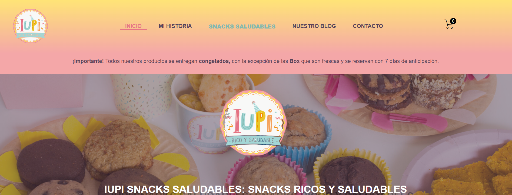
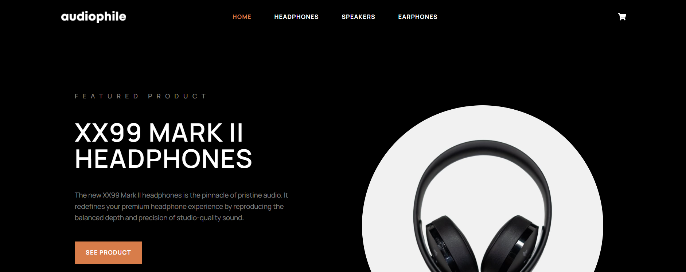

# María Fernanda Mamone – Portfolio

Hi 👋 I’m María Fernanda Mamone, a Fullstack Developer currently completing a Master’s program in Web Development at Conquer Blocks Academy.

This repository contains my personal portfolio built with modern frontend tools and a strong focus on clean structure, scalability, and real-world development practices.

---

## 🚀 About the Project

This portfolio was developed from scratch using a modular and scalable architecture.

It showcases both real-world projects and technical practice work, highlighting my ability to build responsive interfaces and structured codebases.

---

## 🛠 Tech Stack

- HTML5 (semantic structure)
- Sass / SCSS (modular architecture)
- JavaScript (ES6+)
- Vite (build tool)
- Git & GitHub

---

## 📁 Project Structure

The project follows a scalable Sass architecture:

```
src/
 ├── sass/
 │    ├── abstracts/
 │    ├── base/
 │    ├── components/
 │    ├── layout/
 │    ├── themes/
 │    └── main.scss
 ├── main.js
public/
 └── images/
```

---

## 📌 Featured Projects

### Iupi Snacks – E-commerce

[](https://iupisnaksricosysaludables.com.ar)

Real e-commerce website built with WordPress and WooCommerce, including product management and purchase flow.

🔗 Live Demo: https://iupisnaksricosysaludables.com.ar

---

### Audiophile – UI Practice Project

[](https://audiophile.uno)

Practice project focused on UI design and layout using WordPress and Elementor.

🔗 Live Demo: https://audiophile.uno

---

### ConquerBlocks – Multipage Website

[](https://mariafernandamamone.github.io/ConquerBlocks-Website/)

Multipage institutional website focused on layout structure, reusable styles and navigation.

🔗 Live Demo: https://mariafernandamamone.github.io/ConquerBlocks-Website/  
💻 Code: https://github.com/mariafernandamamone/ConquerBlocks-Website

---

## 🌐 Live Demo

👉 https://mariafernandamamone.github.io

---

## 📫 Contact

- LinkedIn: https://www.linkedin.com/in/mfmamone/

---

## 📈 Current Focus

I’m currently improving my skills in:

- JavaScript
- Backend development
- Scalable architecture

---

## 💡 Notes

This project is actively evolving as I continue learning and improving my development workflow and design approach.
